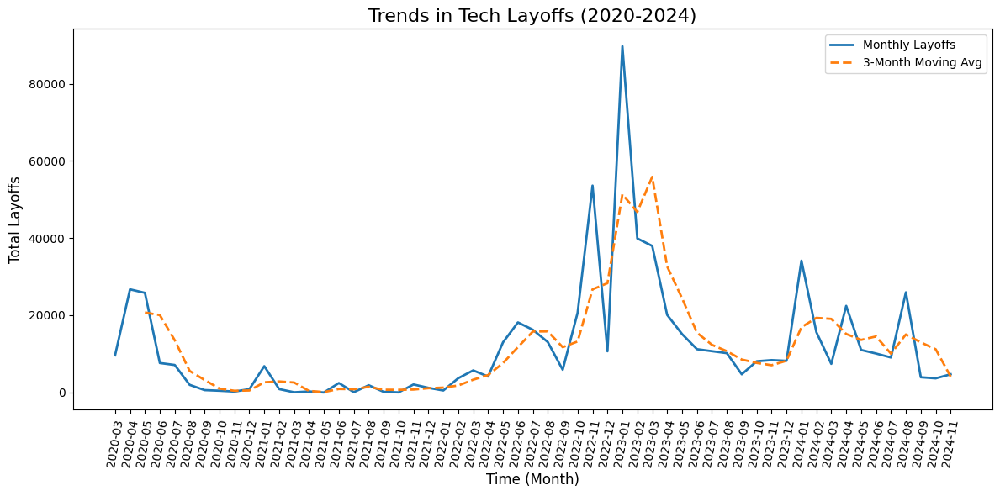
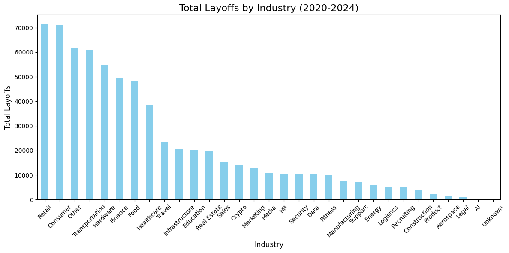
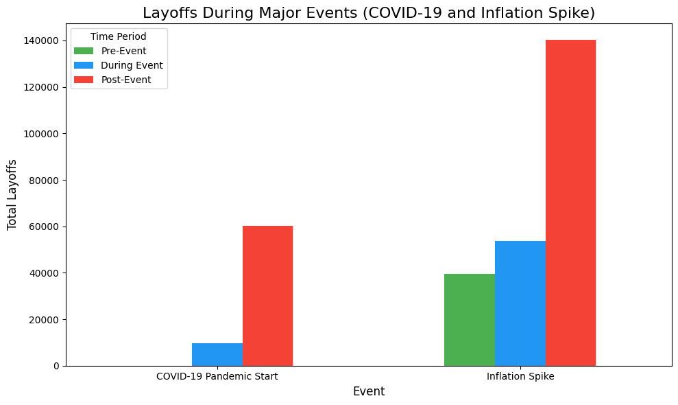

## What trends can be observed in the number of layoffs over time (e.g., by month or year)?

## DESCRIPTION
This visual is showing the number of monthly layoffs over a period of 4 years (2020-2024).

## FINDINGS
- At the beginning of the COVID-19 pandemic (March 2020), there was a noticeable spike in layoffs as companies adjusted to economic uncertainty.
- Layoffs plateaued from June 2020 to February 2022, indicating a period of stability following the initial pandemic shock.
- Starting in September 2022, layoffs surged significantly, peaking around September 2023. This period reflects broader industry challenges and corrections post-pandemic.
- From November 2023 to October 2024, layoffs occurred in smaller but notable surges, suggesting ongoing turbulence in specific sectors.

---

## Are certain industries or sectors within tech more prone to layoffs during economic downturns?

## DESCRIPTION
This visual represents the total number of layoffs per sector to see which sectors had the highest/lowest number of layoffs.

## FINDINGS
### Most Affected Industries
- **Consumer**: This sector experienced the highest number of layoffs (71,046). This reflects the vulnerability of consumer-facing companies during economic slowdowns, as discretionary spending tends to decrease, affecting demand.
- **Retail**: Retail recorded 71,703 layoffs, highlighting the impact of reduced consumer spending and operational challenges during downturns.
- **Transportation**: With 60,798 layoffs, this sector's high numbers may be attributed to reduced travel and supply chain disruptions, particularly during the pandemic.
- **Hardware**: Hardware companies faced 54,870 layoffs, likely reflecting challenges in supply chain management and decreasing demand for physical products.
- **Finance**: The finance sector saw 49,412 layoffs, indicating its sensitivity to macroeconomic factors like inflation and interest rate hikes.

### Moderately Affected Industries
- **Food**: The food industry experienced 48,323 layoffs. This could be tied to shifting consumer behavior and supply chain difficulties during downturns.
- **Healthcare**: With 38,561 layoffs, healthcare saw moderate impacts, possibly driven by funding challenges in health tech startups and shifting healthcare priorities during economic changes.
- **Education**: Education companies recorded 20,111 layoffs, which may reflect reduced investment in educational technology as funding slowed.

### Least Affected Industries
- **AI**: This sector had only 288 layoffs, suggesting that companies in AI were less vulnerable, potentially due to sustained investment and demand for innovation in artificial intelligence.
- **Legal**: The legal sector saw just 966 layoffs, indicating relative stability.
- **Product**: With 2,126 layoffs, this sector appears to have been less impacted overall, potentially reflecting its niche focus.

---

## Were there any periods of heightened layoffs that align with major economic or global events (e.g., pandemic waves, inflation spikes)?

## DESCRIPTION
This visual depicts the amount of layoffs for before, during, and after both the pandemic and inflation. This helps see which major event impacted layoffs the most.

## FINDINGS
### COVID-19 Pandemic:
- Layoffs were concentrated during and immediately after the event, showing a sharp reaction to the pandemic's economic shock.
- The absence of pre-event layoffs highlights the abruptness of the pandemic's impact.

### Inflation Spike:
- Layoffs during and after the inflation spike were significantly higher than those during the pandemic, reflecting the prolonged and compounding challenges of inflation, rising costs, and market corrections.
- Elevated pre-event layoffs suggest that economic conditions were already deteriorating before the official inflation spike.

### Comparison:
- The inflation spike had a more prolonged and substantial impact on layoffs compared to the pandemic, particularly in the post-event period.

